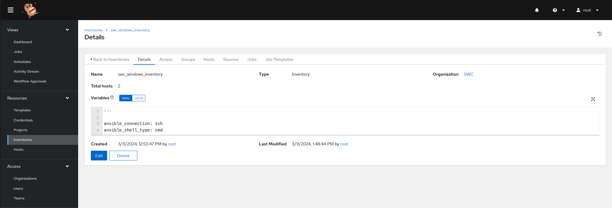
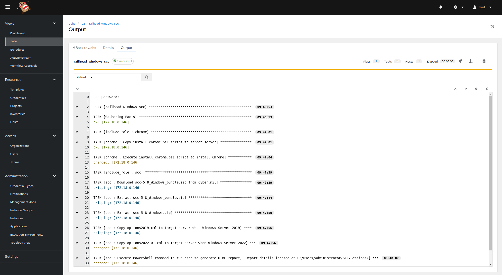
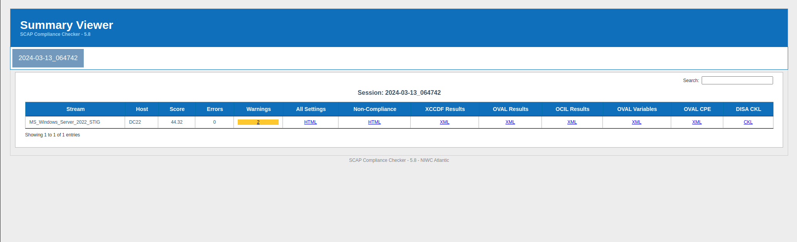
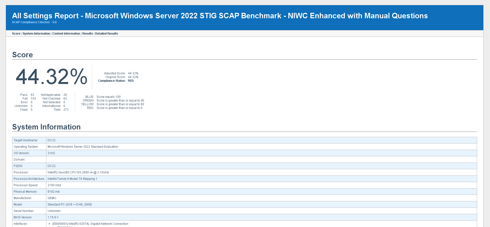

# railhead_windows_scc
* This repository contains playbooks to install chrome and SCC to perform compliance SCAP scan at the Windows_Server_2019_STIG/MS_Windows_Server_2022_STIG benchmark with the MAC-1_Classified profile set. Originally developed for Railhead For any additional details or inquiries, please contact us at christopher.sargent@railhead.io.

* [SCC](https://www.niwcatlantic.navy.mil/Technology/SCAP/)
* [SCAP Content Repository](https://www.niwcatlantic.navy.mil/Technology/SCAP/SCAP-Content-Repository/)
* [Setting up a Windows Host Ansible](https://docs.ansible.com/ansible/latest/os_guide/windows_setup.html)
* [ansible.windows](https://galaxy.ansible.com/ui/repo/published/ansible/windows/docs/)

* Tested on Windows Server 2019/2022
# Prerequisites 
* Install OpenSSH on Windows Server
1. RDP to Server as Admin
2. PowerShell Admin Window
3. Get-WindowsCapability -Online | Where-Object Name -like 'OpenSSH*'
4. Add-WindowsCapability -Online -Name OpenSSH.Client~~~~0.0.1.0 
5. Add-WindowsCapability -Online -Name OpenSSH.Server~~~~0.0.1.0 
* 2019
6. Add-WindowsCapability -Online -Name OpenSSH.Server
* 2022
7. Start-Service sshd 
8. Set-Service -Name sshd -StartupType 'Automatic'
9. Confirm the Firewall rule is configured. It should be created automatically by setup. Run the following to verify
* paste code below
```
if (!(Get-NetFirewallRule -Name "OpenSSH-Server-In-TCP" -ErrorAction SilentlyContinue | Select-Object Name, Enabled)) {
    Write-Output "Firewall Rule 'OpenSSH-Server-In-TCP' does not exist, creating it..."
    New-NetFirewallRule -Name 'OpenSSH-Server-In-TCP' -DisplayName 'OpenSSH Server (sshd)' -Enabled True -Direction Inbound -Protocol TCP -Action Allow -LocalPort 22
} else {
    Write-Output "Firewall rule 'OpenSSH-Server-In-TCP' has been created and exists."
} 
```
10. Get-WindowsCapability -Online | Where-Object Name -like 'OpenSSH*'
* Should display
```
Name  : OpenSSH.Client~~~~0.0.1.0
State : Installed

Name  : OpenSSH.Server~~~~0.0.1.0
State : Installed
```
11. From WSL test via ssh administrator@IP

# Configure AWX
1. https://awxserver > Resoruces > Inventories > swc_windows_inventory > Set variables > Save
```
---

ansible_connection: ssh
ansible_shell_type: cmd
```


2. Configure credentials, project and template
3. https://awxserver > Resources > Templates > railhead_windows_scc > Launch > Prompted for IP > 


4. Sample report located in resources folder 



